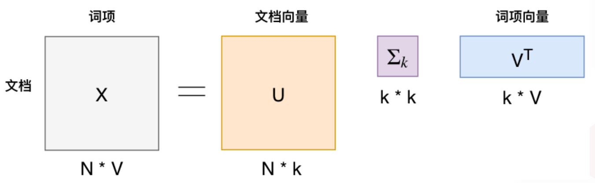

# 文本挖掘
## 基础文本表示
### 文本处理
分词 -> 词性标注 -> 依赖解析 -> 其它（时态，词干，停用词）
### 向量空间模型
用一组词表示一段文本，而不考虑语法或词语顺序  
常用方法：
1. One-Hot
2. Term Frequency(TF)
3. Term Frequency Inversed Document Fequency(TF-IDF)
#### One-Hot
假设现有单词数量为N的词表，可以通过一个长度为N的向量来表示一个单词，在这个向量中该单词对应的位置数值为1，其余单词对应的位置数值全部为0。举例如下：   

| Dict | queen | king | man | woman | boy | girl |
| --- | --- | --- | --- | --- | --- | --- |
| queen | 1 | 0 | 0 | 0 | 0 | 0 |
| king | 0 | 1 | 0 | 0 | 0 | 0 |
| boy | 0 | 0 | 0 | 0 | 1 | 0 |

缺点：
1. 矩阵稀疏
2. 无上下文信息
3. 不考虑词语位置
#### TF
$w$表示单词，$d$表示文本，$f(w,d)$是单词$w$在文本$d$中的频数。

$$
tf(w,d)=log(1+f(w,d))
$$

#### TF-IDF
D表示所有文本集合,$f(w,D)$表示单词$w$在$D$中的频数

$$
\begin{align}
idf(w,D)=log(\frac{N}{f(w,D)}) \\
tf-idf(w,d,D)=tf(w,d)\times idf(w,D)
\end{align}
$$

优点：
- 简单灵活  
缺点：
- Vocabulary：词表的设计要小心，特别是词表的大小
- Sparsity：难以计算和提取信息
- Meaning：没有考虑词语的顺序和上下文信息，也没有考虑词语在$D$中的意思
### 主题模型
#### LSA(潜在语义分析)

  

$$X\approx U_k\Sigma_k V_k^T$$

其中$dim(X)=m\times n$,m为词表长度，n为文本集合大小。上式为对$X$的截断奇异值分解（还可使用非负矩阵分解，总之就是分解为话题空间和文本在话题空间上的投影）。
- 话题空间$U_k$的每一个列向量表示一个话题，称为话题向量。
- $(\Sigma_kV_k^T)$为文本在话题空间的表示  
优点：
- low-dimensional space
- 无监督学习  
缺点：
- 计算复杂，有新文本加入时需要重新训练
- 没有明确的理论解释
#### pLSA(概率潜在语义分析)
优点：
- 建立了一个概率模型，有清晰的理论解释
- 解决了同义词和多义词的问题  
缺点：
- 随着文本和词语的增加，PLSA模型的参数线性增长
- 但它无法生成新的文档模型。我们不知道$p(d)$
- EM算法更加的计算密集
## 文本分类
Pre-trained Word Embedding=Language Model + Pretrained Task
### Language Model
- $S=[w_1,w_2,\cdots,w_T]$
- $P(s)=P(w_1,w_2,\cdots,w_T)=\prod_{t=1}^T P(w_t|w_1,w_2,\cdots,w_{t-1})$
- ngram:$P(s)=P(w_1,w_2,\cdots,w_T)\approx \prod_{t=1}^T P(w_t|w_{t-n+1},\cdots,w_{t-1})$
### 网络模型
#### Interactive Attention Networks
使用Target作为key与context做attention，context作为key与Target做attention  
基于意识
#### Gated Convolutional Networks
sigmoid激活函数作为门控制信息的取舍，然后对应位置相乘
#### AOA-LSTM
内积  
column-wise softmax基于Target的context每个单词的重要程度  
row-wise softmax基于context某个单词，每个Target之间的重要程度
#### Transformer
##### 残差连接
self-attention的输出与$X_embedding$连接  

$$X_{hidden}=X_{embedding}+selfAttention(Q,K,V)$$ 

feed forward也需要要残差连接  

$$X_{hidden}=X_{feedforward}+X_{hidden}$$

##### Layer Normalization
Layer Normalization的作用是把神经网络中隐藏层归一为标准正态分布，也就是独立同分布，以起到加快训练速度，加速收敛的作用。$X_{hidden}=LayerNorm(X_{hidden})$详细操作如下：

$$
\begin{align}
\mu_L=\frac{1}{m}\sum_{i=1}^m(x_i-\mu)^2 \newline
\delta^2=\frac{1}{m}(x_i-u)^2\newline
LN(x_i)=\alpha\frac{x_i-\mu_L}{\sqrt{\delta^2+\epsilon}}+\beta
\end{align}
$$

即每一列独立做归一化，$\epsilon$是为了防止分母为0。$\alpha$初始化为1，$\beta$初始化为0。
##### feed forward
将Multi-Head Attention得到的向量再投影到一个更大的空间（论文里将空间放大了4倍）在那个大空间里可以更方便地提取需要的信息（使用Relu激活函数），最后再投影回token向量原来的空间。

$$
FFN(x)=ReLU(W_{1}x+b1)W_2+b_2
$$

借鉴SVM来理解：SVM对于比较复杂的问题通过将特征其投影到更高维的空间使得问题简单到一个超平面就能解决。这里token向量里的信息通过Feed Forward Layer被投影到更高维的空间，在高维空间里向量的各类信息彼此之间更容易区别。

bert可以当作提取hidden的替换
### 评价指标
TP：True Positive 真实为正，预测为正  
FP: False Positive 真实为反，预测为正  
TN：...  
FN：...  
precision：$\frac{TP}{TP+FP}$,预测为正中的真正例子的比率  
recall：$\frac{TP}{TP+FN}$，所有正例中的预测为正例的比率  
AUC：  
$AUC=P(P_{positive}>P_{negative})$，等于ROC曲线与x轴面积。  
近似计算  
P=0.6 (1)  
P=0.3 (2)  
N=0.7 (3)  
N=0.2 (4)  
N=0.4 (5)  
每一个正例与反例比较  
$AUC=\frac{2+1}{2\times 3}$  
(1)>(4),(1)>(5)  
(2)>(4)