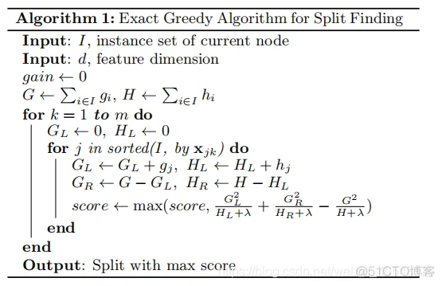
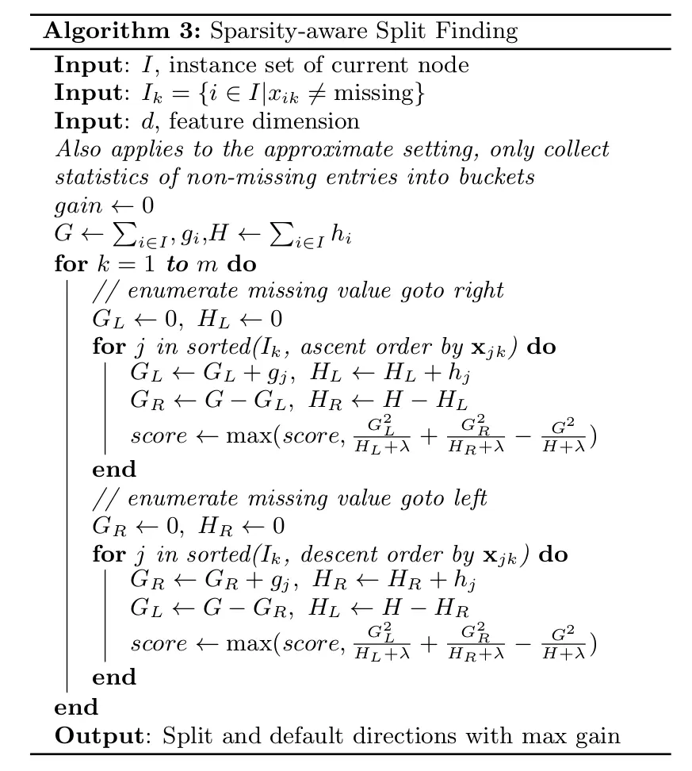

## 调参数
1) 网格搜索
2) 随机搜索
3) 贝叶斯
4) [正交设计](https://blog.csdn.net/LittleDonkey_Python/article/details/84203295)
## EM算法
缺失数据（隐变量）概率模型的极大似然估计方法。  
不断迭代E步，M步  
E步： 计算Q函数(完全数据对数似然函数对隐变量条件期望)  
$Q(\theta,\theta^{(i)})=E_z[logP(X,Z|\theta)|X,\theta^{(i)}]$  
M步：极大化Q函数  
$\theta^{(i+1)}=\underset{\theta}{argmax}Q(\theta,\theta^{(i)})$
### EM算法的导出
不完全时速据$X$关于参数$\theta$的对数似然函数：

$$
\begin{align}
L(\theta)=&logP(X|\theta)=log\sum_Z P(X,Z|\theta)\\
=&log(\sum_Z P(X|Z,\theta)P(Z|\theta))
\end{align}
$$

EM算法的通过不断迭代逐步近似极大化$L(\theta)$，我们希望新估计值$\theta$使得$L(\theta)\lt L(\theta^{(i)})$,所以考虑二者差值,不等式由Jensen不等式导出

$$
\begin{align}
L(\theta)-L(\theta_{(i)})&=log(\sum_Z P(Z|X,\theta^{(i)})\frac{P(X|Z,\theta)P(Z|\theta)}{P(Z|X,\theta^{(i)})}-logP(X|\theta^{(i)})\\
&\geq \sum_Z P(Z|X,\theta^{(i)})log\frac{P(X|Z,\theta)P(Z|\theta)}{P(Z|X,\theta^{(i)})}-log(X|\theta^{(i)})\\
&=\sum_Z P(Z|X,\theta^{(i)})log\frac{P(X|Z,\theta)P(Z|\theta)}{P(Z|X,\theta^{(i)})P(X|\theta^{(i)})}
\end{align}
$$

$B(\theta,\theta^{(i)})=L(\theta^{(i)})+\sum_Z P(Z|X,\theta^{(i)})log\frac{P(X|Z,\theta)P(Z|\theta)}{P(Z|X,\theta^{(i)})P(X|\theta^{(i)})}$，是$L(\theta)$的下界，$L(\theta^{(i)})=B(\theta^{(i)},\theta^{(i)})$

$$
\begin{align} 
\theta^{(i+1)}&=\underset{\theta}{argmax}B(\theta,\theta^{(i)})\\
&=\underset{\theta}{argmax}\sum_Z P(Z|X,\theta^{(i)})(logP(X,Z|\theta)-logP(X,Z|\theta^{(i)})\\
&=\underset{\theta}{argmax}\sum_Z P(Z|X,\theta^{(i)})logP(X,Z|\theta)
\end{align}
$$

## 变分推断

$$
\begin{align}
P(X|\theta)&=\frac{P(X,Z|\theta)}{P(Z|X,\theta)}\\
L(\theta)&=logP(X|\theta)\\
&=logP(X,Z|\theta)-logP(Z|X,\theta)\\
&=log\frac{P(X,Z|\theta)}{q(z)}-log\frac{P(Z|X,\theta)}{q(z)}
\end{align}
$$

不完全数据对数似然 = 完全数据对数似然-隐变量对数似然  
等式两边对$z$积分，$logP(X|\theta)$与$z$无关积分后不变,即

$$
\begin{align}
L(\theta)&=\int_z q(z)log\frac{P(X,Z|\theta)}{q(z)}dz+(-\int_z q(z)log\frac{P(Z|X,\theta)}{q(z)})dz\\
&=\mathcal{L}(q)+KL(q||p)
\end{align}
$$

Encoder生成$q(z|x,\phi)$,decoder生成$p(x|z,\phi)$  
与EM不同:
- 后验分布不同（变分是找一个与后验最相似的函数）
- 
## MM算法
## 决策树
## Boost方法
### AdaBoost
- 标准AdaBoost只能二分类  
思想：在误判样本上给与更大关注  
多个基学习器其串行执行，下一个学习器基于上一个学习器的经验，通过调整样本的权重，使得上一个错分的样本在下一个分类器更受重视而达到不断提升的效果。  
先从初始训练样本中训练一个基学习器（也称弱学习器），再根据基学习器的表现对训练样本的分布进行调整，使得先前基学习器分类错误的样本在后续中受到更多的关注（即加大权重），然后基于调整后的样本分布来训练下一个基学习器，如此重复进行，直至基学习器的数量达到事先指定的值T，最终将这T个基学习器进行加权结合。

1. 基学习器的误差越小，权重越大
#### 算法流程
1. 初始化样本权重  

   $$D_1=(w_{11},\cdots,w_{1i},\cdots,w_{1N}),w_{1i}=\frac{1}{N}$$

2. 
#### Reference
[1] https://www.jianshu.com/p/920d63cf7bcb
### Gradient Boosting
目标L，L对$F_t(x)$的梯度，以梯度为模型，学习一个子模型$h_t$,\  
$h_t$可以看作对梯度下降方向的估计，$\gamma$看做步长  
$F_{t+1}=F_t+\gamma h_t$
### XGBoost
基分类器：XGBoost的基分类器不仅支持CART决策树，还支持线性分类器，可以解决分类和回归问题。

损失函数：XGBoost对损失函数采用了二阶泰勒展式，GBDT只用了一阶导数信息，并且XGBoost还支持自定义损失函数，但要求损失函数一阶、二阶可导。

正则化：XGBoost的目标函数加了正则项， 相当于预剪枝，这样学习出来的模型更加不容易过拟合。
- 预测值  
  $\hat{y_i}^{(t)}=\sum_{j=1}^t f_t(x_i)=\hat{y_i}^{(t-1)}+f_t(x_i)$
#### 目标函数

$$
\begin{align}
L(\phi)=\sum_{i=1}^{n}l(y_i',y_i)+\sum_{k}\Omega(f_k)\\
\Omega(f)=\gamma T+\frac{1}{2}\lambda ||w||^2
\end{align}
$$

$l$是对单样本的损失；$\Omega$是正则化项，定义了模型复杂度;$\gamma$和$\lambda$为人工设置的参数,$w$为决策树所有叶子节点值形成的向量，T为叶子节点数。  
对第t棵树的目标函数

$$
\begin{align}
L^{(t)}&=\sum_{i=1}^{n}l(\hat{y_i}^{(t)},y_i)+\sum_{j=1}^t\Omega(f_j)\\
&=\sum_{i=1}^{n}l(\hat{y_i}^{(t-1)}+f_t(x_i),y_i)+\sum_{i=j}^t\Omega(f_j)\\
&\approx\sum_{i=1}^{n}[l(\hat{y_i}^{(t-1)},y_i)+g_if_t(x_i)+\frac{1}{2}h_if_t(x_i)^2]+\Omega(f_t)
\end{align}
$$

式中最后行使用了在$\hat{y_i}^{(t-1)}$处的泰勒展开，优化第t棵树的时候，前t-1棵已经确定，所以只有当前树的正则项

$$
\begin{align} 
L^{(t)}&=\sum_{i=1}^n[g_if_t(x_i)+\frac{1}{2}h_if_i^2(x_i)]+\Omega(f_t)+C\\
&=\sum_{j=1}^T[(\sum_{i\in I_j} g_i)w_j+\frac{1}{2}(\sum_{i\in I_j}h_i+\lambda)\omega_j^2]+\gamma T+C
\end{align} 
$$

因为各$w_j$无交互，所以分别最大化。对于一个固定的结构$q(x)$,最优的参数如下

$$
\omega_j^*=-\frac{\sum_{i\in I_j} g_i}{\sum_{i\in I_j}h_i+\lambda}
$$

此时目标值为

$$
L(q)=-\frac{1}{2}\sum_{j=1}^T\frac{(\sum_{i\in I_j}g_i)^2}{\sum_{i\in I_j}h_i+\lambda}+\gamma T
$$

$L-L_L-L_R$用于评估分割$I$为$I_L$和$I_R$带来的收益

$$
L_{split}=\frac{1}{2}[\frac{(\sum_{i\in I_L}g_i)^2}{\sum_{i\in I_L}h_i+\lambda}+\frac{(\sum_{i\in I_R}g_i)^2}{\sum_{i\in I_R}h_i+\lambda}-\frac{(\sum_{i\in I}g_i)^2}{\sum_{i\in I}h_i+\lambda}]-\gamma
$$

#### 子采样和权值收缩
除了损失函数中的正则项，文中还提出了两种降低过拟合的方式–学习率和列采样。  
子采样分为样本子采样和特征子采样。子采样算是RF的代表了，通常来说我们使用特征取样更多。特征子采样从不同角度去考量样本能让模型更具有多样性。通过随机性降低过拟合，根据反馈，使用列子采样比传统的行子采样更有效的防止过拟合。  
权值收缩也就是对叶子节点的权值乘上收缩因子，该收缩因子是人为设定的参数。假如一棵树把损失函数降得很低很低，那么后续的优化空间就少了，训练的样本和特征也就少了，最后也就overfitting。  
XGB不仅仅只有这些tricks，例如leaf-wise, 后剪枝，树高度控制等
#### 分支查找算法
##### 基础的精确贪心算法
  
循环遍历每一个特征，在每一个特征中排序后，从小到大遍历所有可分点分割的收益，去最大收益为分割点
##### 近似算法
![[xgboost_approx.png]]  
直方图算法  
加权分位数算法是确定近似算法中候选点的一种方法
##### 加权分位数算法
加权分位数的算法选出了一些可能的分裂点，然后再遍历这些较少的分裂点来找到最佳分裂点。加权是用二阶导数加权的  
定义第k个特征值和每一个训练样本的二阶导组成的集合  
$D_k=\{(x_{1k},h_1)\cdots,(x_{nk},h_n)\}$  
定义一个rank函数

$$
r_k(z)=(\sum_{(x,h)\in D_k,x<z}h)/(\sum_{(x,h)\in D_k}h)
$$

rank的计算是对某一个特征上，样本特征值小于z的二阶梯度除以所有的二阶梯度总和。其实就是对样本的二阶梯度进行累加求和，那二阶梯度在这里就是代表样本在特征k上的权值。(为什么用二阶梯度作为权值，下式)

$$
L^{(t)}=\sum_{i=1}^n\frac{1}{2}h_i(f_t(x_i)-g_i/h_i)^2+\Omega(f_t)+C
$$

找出一组候选分割点$\{s_{k1},\cdots,s_{kl}\}$，使得其满足

$$
|r_k(s_{k,j})-r_k(s_{k,j+1})|<\epsilon,s_{k1}=\underset{i}{min}X_{ik},s_{kl}=\underset{i}{max}X_{ik}
$$

$\epsilon$是近似因子，我们可以大致的认为有$\frac{1}{ε}$候选点。  
有两种候选点选取方法  
1) 建立第k棵树的时候确定候选点，每一次分支都使用它
2) 每次进行分支时，我们都重新计算候选点，再进行分支判断。前者我们称之为全局选择，后者称为局部选择。
##### 稀疏数据分支
XGBoost设定一个默认分支，数据缺失时走向默认分支  
造成稀释数据的原因:
1) 数据缺失
2) 统计指标就是稀疏的
3) 人为转换（one-hot等）  

#### 特点
- XGBoost工具支持并行（注意XGBoost的并行不是tree粒度的并行）。XGBoost在训练之前，预先对数据每个特征排序，然后保存为block结构，后面的迭代中重复地使用这个结构。在进行节点的分裂时，需要计算每个特征的增益，最终选增益最大的那个特征去做分裂，那么各个特征的增益计算就可以开多线程进行。
- 高度的灵活性。XGBoost支持用户自定义目标函数和评估函数，只要目标函数二阶可导就行。
- 缺失值处理。XGBoost内置处理缺失值的规则。用户需要提供一个和其它样本不同的值，然后把它作为一个参数传进去，以此来作为缺失值的取值。XGBoost在不同节点遇到缺失值时采用不同的处理方法，并且会学习未来遇到缺失值时的处理方法。
#### 参数
##### 通用参数 
- **booster[默认gbtree]** 选择每次迭代的模型，有两种选择：
    - gbtree：基于树的模型
    - gbliner：线性模型。使用带l1,l2 正则化的线性回归模型作为基学习器。因为boost 算法是一个线性叠加的过程，而线性回归模型也是一个线性叠加的过程。因此叠加的最终结果就是一个整体的线性模型，xgboost 最后会获得这个线性模型的系数。
    - dart： 表示采用dart booster
- **nthread[默认值为最大可能的线程数]** 这个参数用来进行多线程控制，应当输入系统的核数。如果你希望使用CPU全部的核，那就不要输入这个参数，算法会自动检测它。
##### Tree Booster
因为tree booster的表现远远胜过linear booster，所以linear booster很少用到。针对tree booster 的参数（适用于booster=gbtree,dart) ：
- **eta[默认3]** 和GBM中的 learning rate 参数类似。通过减少每一步的权重，可以提高模型的鲁棒性。范围为 [0,1]，典型值为0.01-0.2。
- **min_child_weight[默认1]** 子节点的权重阈值。它刻画的是：对于一个叶子节点，当对它采取划分之后，它的所有子节点的权重之和的阈值。所谓的权重，对于线性模型(booster=gblinear)，权重就是：叶子节点包含的样本数量，对于树模型（booster=gbtree,dart），权重就是：叶子节点包含样本的所有二阶偏导数之和。这个参数用于避免过拟合。当它的值较大时，可以避免模型学习到局部的特殊样本。但是如果这个值过高，会导致欠拟合。这个参数需要使用CV来调整。该值越大，则算法越保守（尽可能的少划分）。
    - 如果它的所有子节点的权重之和大于该阈值，则该叶子节点值得继续划分
    - 如果它的所有子节点的权重之和小于该阈值，则该叶子节点不值得继续划分
- **max_delta_step[默认为0]** 每棵树的权重估计时的最大delta step。取值范围为[0,∞]，0 表示没有限制。
- **max_depth[默认6]** GBM中的参数相同，这个值为树的最大深度。这个值也是用来避免过拟合的。max_depth越大，模型会学到更具体更局部的样本。需要使用CV函数来进行调优。典型值：3-10
- **max_leaf_nodes** 树上最大的节点或叶子的数量。可以替代max_depth的作用。因为如果生成的是二叉树，一个深度为n的树最多生成n^2个叶子。如果定义了这个参数，GBM会忽略max_depth参数。
- **gamma[默认0]** 也称作最小划分损失min_split_loss。 它刻画的是：对于一个叶子节点，当对它采取划分之后，损失函数的降低值的阈值。该值越大，则算法越保守（尽可能的少划分）。默认值为 0
    - 如果大于该阈值，则该叶子节点值得继续划分
    - 如果小于该阈值，则该叶子节点不值得继续划分
- **max_delta_step[默认0]** 这参数限制每棵树权重改变的最大步长。如果这个参数的值为0，那就意味着没有约束。如果它被赋予了某个正值，那么它会让这个算法更加保守。通常，这个参数不需要设置。但是当各类别的样本十分不平衡时，它对逻辑回归是很有帮助的。这个参数一般用不到，但是你可以挖掘出来它更多的用处。
- **subsample[默认1]** 对训练样本的采样比例。和GBM中的subsample参数一模一样。这个参数控制对于每棵树，随机采样的比例。减小这个参数的值，算法会更加保守，避免过拟合。但是，如果这个值设置得过小，它可能会导致欠拟合。 典型值：5-1
- **colsample_bytree[默认1]** 构建子树时，对特征的采样比例。和GBM里面的max_features参数类似。用来控制每棵随机采样的列数的占比(每一列是一个特征)。典型值：5-1
- **colsample_bylevel[默认1]** 寻找划分点时，对特征的采样比例。用来控制树的每一级的每一次分裂，对列数的采样的占比。一般不太用这个参数，因为subsample参数和colsample_bytree参数可以起到相同的作用。如果为5， 表示随机使用一半的特征来寻找最佳划分点。它有助于缓解过拟合。
- **lambda[默认1]** 权重的L2正则化项。(和Ridge regression类似)。这个参数是用来控制XGBoost的正则化部分的。该值越大则模型越简单。
- **alpha[默认0]** 权重的L1正则化项。(和Lasso regression类似)。 可以应用在很高维度的情况下，使得算法的速度更快。该值越大则模型越简单。
- **scale_pos_weight[默认1]** 用于调整正负样本的权重，常用于类别不平衡的分类问题。一个典型的参数值为：负样本数量/正样本数量。
- **tree_method[默认为’auto’]** 指定了构建树的算法，可以为下列的值(分布式，以及外存版本的算法只支持 ‘approx’,’hist’,’gpu_hist’ 等近似算法)：
    - ‘auto’： 使用启发式算法来选择一个更快的tree_method：
        - 对于小的和中等的训练集，使用exact greedy 算法分裂节点
        - 对于非常大的训练集，使用近似算法分裂节点
        - 旧版本在单机上总是使用exact greedy 分裂节点
    - ‘exact’： 使用exact greedy 算法分裂节点
    - ‘approx’： 使用近似算法分裂节点
    - ‘hist’： 使用histogram 优化的近似算法分裂节点（比如使用了bin cacheing 优化）
    - ‘gpu_exact’： 基于GPU 的exact greedy 算法分裂节点
    - ‘gpu_hist’： 基于GPU 的histogram 算法分裂节点
- **sketch_eps[默认值为03]** 指定了分桶的步长。其取值范围为 (0,1)。它仅仅用于 tree_medhod=’approx’。它会产生大约1/ sketch_eps个分桶。它并不会显示的分桶，而是会每隔 sketch_pes 个单位（一个单位表示最大值减去最小值的区间）统计一次。用户通常不需要调整该参数。
- **updater[默认为 ‘grow_colmaker,prune’]** 它是一个逗号分隔的字符串，指定了一组需要运行的tree updaters，用于构建和修正决策树。该参数通常是自动设定的，无需用户指定。但是用户也可以显式的指定。
- **refresh_leaf[默认为1]** 它是一个updater plugin。 如果为 true，则树节点的统计数据和树的叶节点数据都被更新；否则只有树节点的统计数据被更新。
- **process_type** 指定要执行的处理过程（如：创建子树、更新子树）。该参数通常是自动设定的，无需用户指定。
- **grow_policy[默认为’depthwise’]** 用于指定子树的生长策略。仅仅支持tree_method=’hist’。 有两种策略：
    - ‘depthwise’：优先拆分那些靠近根部的子节点。
    - ‘lossguide’：优先拆分导致损失函数降低最快的子节点
- **max_leaves[默认为0]** 最多的叶子节点。如果为0，则没有限制。该参数仅仅和grow_policy=’lossguide’ 关系较大。
- **max_bin[默认值为 256]** 指定了最大的分桶数量。该参数仅仅当 tree_method=’hist’,’gpu_hist’ 时有效。
- **Predictor[默认为’cpu_predictor’]** 指定预测器的算法，可以为：
    - ‘cpu_predictor’： 使用CPU 来预测
    - ‘gpu_predictor’： 使用GPU 来预测。对于tree_method=’gpu_exact,gpu_hist’， ‘gpu_redictor’ 是默认值。

$$
-\sum_{i=1}^{n} \frac{\left|D_{i}\right|}{|D|} \log \frac{\left|D_{i}\right|}{|D|}
$$

### 参考
1) [决策树与提升方法](https://bailingnan.github.io/post/lesslesstong-ji-xue-xi-fang-fa-greatergreater-lesslessji-qi-xue-xi-greatergreater-jue-ce-shu-ji-cheng-xue-xi)
2) [XGBoost](https://bailingnan.github.io/post/shen-ru-li-jie-xgboost)
3) [XGBoost](https://zhuanlan.zhihu.com/p/508365716)
## Bagging
- 并行式集成学习方法
- 基于自助采样法（bootstrap sampling）
- 适用多分类、回归等任务
- `Bagging`主要关注降低方差，因此它在不剪枝决策树、神经网络等易受样本扰动的学习器上效用更为明显。  
step:
1) 有返回抽样抽取T个含m个训练样本的采样集（由Bootstrap每个采样集约有63.2%的不重复样本）
2) 对每个采样集训练出一个基学习器
3) 将这些基学习器进行结合  
tricks:  
每个基学习器只使用了初始训练集中约 63.2%的样本（Bootstrap），剩下约 36.8%的样本可用作验证集来对泛化性能进行“包外估计”(out-of-bag estimate).  
基学习器是决策树时，可使用包外样本来辅助剪枝，或用于估计决策树中各结点的后验概率以辅助对零训练样本结点的处理；当基学习器是神经网络时，可使用包外样本来辅助早期停止以减小过拟合风险。

### 结合策略
不同类型的$h_{i}^{j}(\boldsymbol{x})$（基学习器）值不能混用,比如：
- 类标记 直接预测结果，给出具体属于哪个类
- 类概率 $P(c_i|x)$，给出属于每个类的概率
#### 数值型
##### 简单平均法
##### 加权平均法
#### 分类型
##### 绝对多数投票法
超过1/2才给出预测，否则拒绝预测
##### 相对多数投票法
得票最多的标记
##### 加权投票法
每个学习器有不同权重，取加权后最大的
### 随机森林（Random Forest）
每个决策树的训练样本通过Bootstrap抽取，在构建决策树时，对基决策树的每个结点，先从该结点的属性集合中随机选择一个包含k个属性的子集，然后再从这个子集中选择一个最优属性用于划分，这里的参数k控制了随机性的引入程度。一般情况下，推荐值$k=\log _{2}d$。  
细节:  
1) Bootstrap抽取M个子训练集
2) 每个子训练集分别训练一个决策树
3) 决策树的每个结点，先从该结点的属性集合中随机选择一个包含k个属性的子集，然后再从这个子集中选择一个最优属性用于划分，这里的参数k控制了随机性的引入程度。一般情况下，推荐值$k=\log _{2}d$。 
## Stacking
`Stacking`先从初始数据集训练出初级学习器，然后“生成”一个新数据集用于训练次级学习器。在这个新数据集中，初级学习器的输出被当作样例输入特征，而初始样本的标记仍被当作样例标记。这里我们假定初级学习器使用不同学习算法产生，即初级集成是异质的。  
steps:
1) 从初始数据集训练出T个初级学习器
2) T个初级学习器的输出当作新特征，原标签作为label构建新`次级训练集`。
3) 用`次级训练集`训练次级学习器